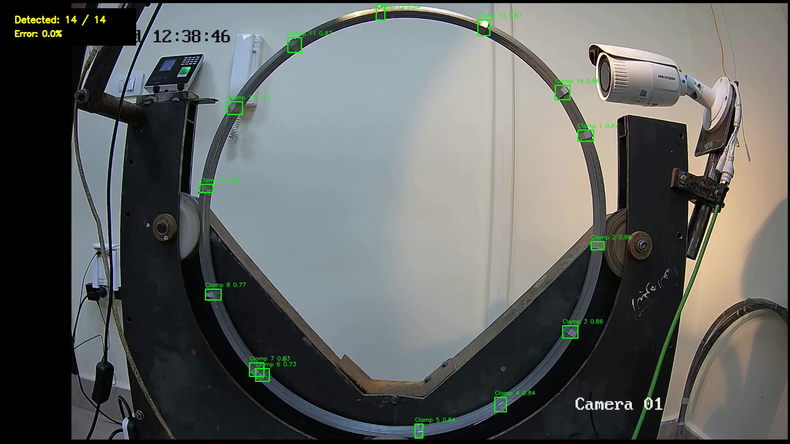
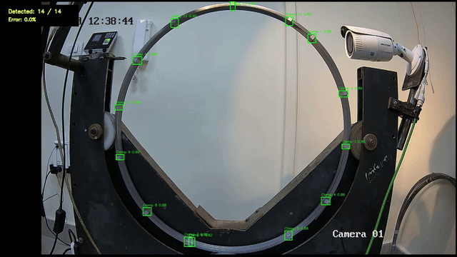

# Clamp Detection & Stable Circular Tracking

A computer-vision pipeline for detecting **14 clamps** on a circular moving system and assigning persistent logical IDs **1–14**.

The project uses **YOLO11m** for detection, **BoT-SORT** for temporal tracking, and a custom geometry-aware ID layer based on a **circular motion model**, **Hungarian assignment**, **angular gating**, and **motion prediction**.



## Project Goal

The target was not only to detect clamps, but to keep their displayed identities stable while the mechanism moves. The system also overlays:

- detected clamp count (`n / 14`)
- a frame-level detection-count error percentage
- logical clamp IDs from `1` to `14`

## Key Challenge

The project was developed under a strict constraint of only **30 annotated frames extracted from the original video**.

No image editing or synthetic data augmentation was used to artificially expand or modify the dataset. Despite this limited data, the system had to detect small, closely spaced clamps under challenging reflections while maintaining stable logical IDs for all 14 clamps throughout circular motion.

## Dataset

Only **30 annotated video frames** were available for the entire dataset.

| Split | Frames |
|---|---:|
| Train | 24 |
| Validation | 4 |
| Test | 2 |
| Classes | 1 (`Clamp`) | 

Preprocessing was limited to **Auto-Orient**, while augmentation was disabled for this dataset version.

> **Dataset note:** The source dataset is private and is intentionally not included in this public repository.
## Detector

**Model:** YOLO11m  
**Training:** 150 epochs  
**Input size:** 960 px  
**Optimizer:** AdamW

Validation results recorded during the project:

| Metric | Value |
|---|---:|
| Precision | 0.992 |
| Recall | 0.982 |
| mAP@50 | 0.995 |
| mAP@50-95 | 0.827 |

Because the validation split contains only **4 images**, these values should be interpreted cautiously and not treated as a strong independent benchmark.

## Engineering Iterations

The final result came from several iterations rather than a single detector/tracker run.

### 1. Adjacent clamps merged into one detection

The detector sometimes produced one bounding box for two neighboring physical clamps.

**Diagnosis:** annotation/detection issue rather than a tracker issue.

**Fix:** manually review the 30 annotations, ensure neighboring clamps are labeled separately, create Dataset Version 3, and retrain YOLO11m.

### 2. Raw BoT-SORT IDs were not suitable for presentation

BoT-SORT produced internal track IDs that could become large values.

**Attempt:** map tracker IDs to logical clamp IDs `1–14`.

This improved readability, but introduced another failure.

### 3. Duplicate logical IDs

Two detections could occasionally receive the same logical ID in one frame.

**Fix:** enforce one logical ID per detection per frame.

### 4. Major ID redistribution during a detection drop

Around the difficult section near **22 seconds**, several detections temporarily disappeared and returned. A nearest-position remapping strategy could then redistribute many IDs incorrectly.

The key observation was that the clamps do **not** move randomly: they are constrained to a circular path and preserve physical order.

### 5. Final stable-ID strategy

The final identity layer combines:

1. YOLO11m detection
2. BoT-SORT temporal tracking
3. circular-path initialization when all 14 clamps are visible
4. predicted angular position for every logical clamp
5. Hungarian one-to-one assignment
6. 25-degree angular gating to reject implausible jumps
7. angular-velocity prediction during temporary detection dropouts

This keeps the logical IDs much more stable through short detection failures.

## Pipeline

```text
30 images
   ↓
YOLO11m detector
   ↓
Annotation review + retraining
   ↓
BoT-SORT
   ↓
Logical IDs 1–14
   ↓
Duplicate-ID protection
   ↓
Circular motion model
   ↓
Hungarian assignment + angular gating
   ↓
Motion prediction during dropouts
   ↓
Stable IDs + count + count-error overlay
```

## Repository Structure

```text
clamp-detection-tracking/
├── README.md
├── requirements.txt
├── .gitignore
├── notebooks/
│   └── Clamp_Detection_Tracking_Project.ipynb
├── src/
│   └── stable_circular_tracking.py
├── configs/
│   └── custom_botsort_v3.yaml
└── assets/
    ├── stable_tracking_overview.jpg
    ├── stable_tracking_22s.jpg
    └── stability_demo.gif
```

## Run the Final Tracker

Install dependencies:

```bash
pip install -r requirements.txt
```

Then run:

```bash
python src/stable_circular_tracking.py \
  --weights path/to/best.pt \
  --input path/to/input_video.mp4 \
  --tracker configs/custom_botsort_v3.yaml \
  --output results/V3_STABLE_CIRCULAR_IDS.mp4
```

The trained weights and private source dataset are not distributed in this repository.

## Error Metric

The overlay uses:

```text
count error (%) = |14 - detected_count| / 14 × 100
```

This is only a **frame-level count error**. It is **not** a complete multi-object-tracking metric such as IDF1, HOTA, or MOTA.

## Limitations

- The dataset contains only 30 source images.
- Validation contains only 4 images, so validation metrics may look optimistic.
- The displayed error metric measures count accuracy only.
- A stronger evaluation should use a larger independent test set and identity-aware MOT metrics such as ID switches, IDF1, HOTA, or MOTA.
- The circular-ID layer is tailored to this mechanism's constrained circular motion.

## Demo

The GIF below shows a short segment from the final processed video.



## Tools

Python · Ultralytics YOLO11 · OpenCV · BoT-SORT · SciPy · NumPy · Roboflow · Kaggle GPU

---

**Author:** Zyad Khalaf Amen  
Mechatronics Engineering Student — Misr University for Science and Technology (MUST)
